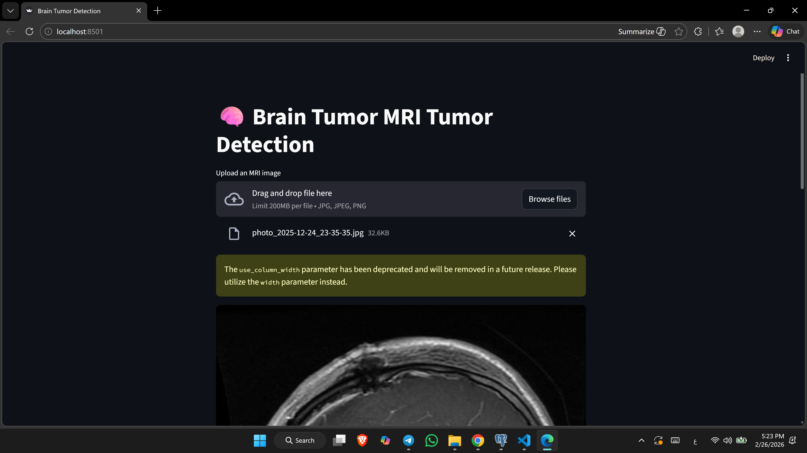
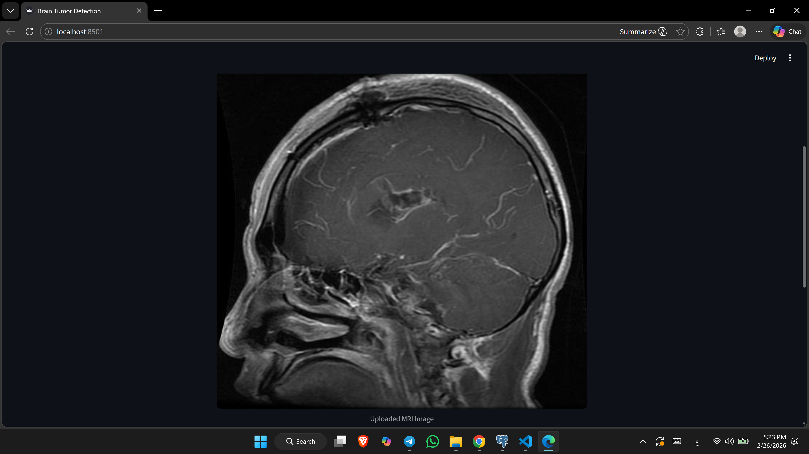
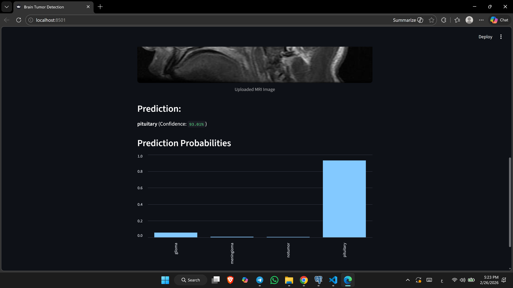

# 🧠 Brain Tumor Classification using ResNet50

## 📌 Project Overview

This project is a Deep Learning web application that classifies brain MRI images into four tumor categories using Transfer Learning with ResNet50.  
The model is deployed using Streamlit to provide real-time predictions with probability scores.

The model predicts one of the following classes:

🧬 Glioma

🧠 Meningioma

🚫 No Tumor

🔵 Pituitary Tumor

## 📸 Demo
### 🏠 Home Page

### 🔍 Prediction Result

### 📊 Prediction Probabilities

## 🧠 Model Architecture

Transfer Learning using ResNet50

Custom Fully Connected Layers

Softmax activation for multi-class classification

Image preprocessing & augmentation

## ⚙️ Training Details

Optimizer: Adam

Loss: Categorical Crossentropy

Output Layer: 4 neurons (Softmax)

Evaluation Metric: Accuracy

Model saved as: brain_tumor_resnet50.keras

## 🛠 Tech Stack

Python

TensorFlow / Keras

NumPy

Matplotlib

Streamlit

## 📊 Dataset

Brain MRI Dataset from Kaggle:  
https://www.kaggle.com/datasets/masoudnickparvar/brain-tumor-mri-dataset

Classes:

glioma

meningioma

notumor

pituitary

Dataset not included due to size limitations.

## 📈 Model Performance

### Training Accuracy: 84.99%  
### Validation Accuracy: 74.58 %  

#### The model demonstrates strong generalization on unseen MRI images.
#### Model evaluated on separate validation dataset.

## 🔍 Prediction Example

### Input MRI Image → pituitary (Confidence: 93.01%)

## 📂 Project Structure

brain-tumor-detection/

│

├── app.py

├── BrainTumerDetection.ipynb

├── requirements.txt

├── README.md

└── images/                                
    ├── home.png
    ├── prediction.png
    ├── probabilities.png

## 🚀 How to Run

Clone the repository

Install dependencies

pip install -r requirements.txt

Run Streamlit app

streamlit run app.py

Or open the notebook:
BrainTumerDetection.ipynb

## 👩‍💻 Author

### Heba Shams
### AI & Backend Enthusiast 🤖✨
